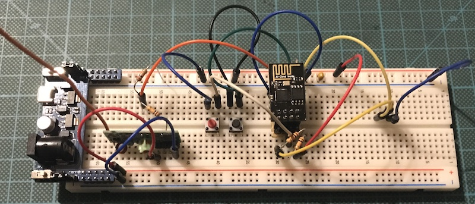
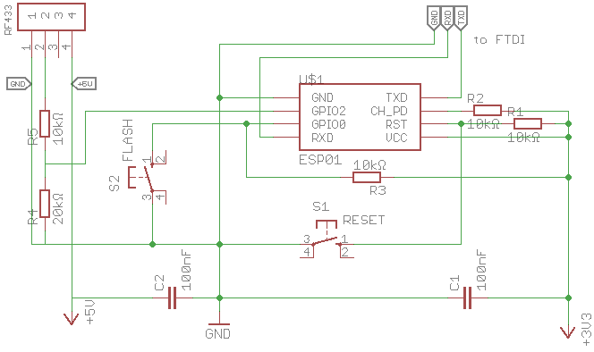
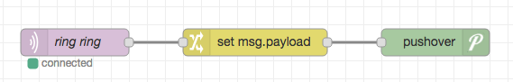

# 433MHz ESP MQTT Doorbell Receiver

I wanted to be able to get noticed when our doorbell rang. It is a cheap radio doorbell labeled QH-C-CE, which I ordered from amazon years ago. 
After opening it up I was lucky to find a 433MHz crystal and thought it must be possible to receive a radio packet from it.

So I ordered some cheap [433MHz modules](https://www.amazon.de/XCSOURCE-Transmitter-Receiver-Arduino-TE122/dp/B00V4ISS38/ref=sr_1_3?ie=UTF8&qid=1490643731&sr=8-3) and started to investigate. Luckily there is already a versatile library to receive 433MHz-signal: [rc-switch](https://github.com/sui77/rc-switch) - of course this should also work with 315MHz devices.

I've used the `receive-simple` example and got a very clear reception from my doorbell button. Also I got the radio code for my particular sender. Then it was quite simple to write a basic sketch which sends an mqtt message everytime the doorbell button gets pressed.

## Wiring
This needs the mentioned 433MHz-Receiver Modules and is designed for an ESP8266. I my case I've used an ESP-01 as I need only need one GPIO.

The receiver should be fitted with a 17cm solid core wire as antenna and _must_ be supplied with 5V as the reception is very poor if you drive it with 3.3V.

The ESP-01 needs 3.3V so you need to level-shift the output of the receiver module (5V) before feeding it into the ESP. I've used a voltage divider (20kΩ/10kΩ, `R4`/`R5`) which is not the best way but worked very well. The output is wired to `GPIO2` of the ESP.

### Breadboard

### Schematics

Here's the eagle file: [esp-mqtt-doorbell-receiver.sch](esp-mqtt-doorbell-receiver.sch)

## Functions
The sketch simply listens for a radio packet with the configured code. On receiving it publishes a message to an mqtt-broker to `<topic-prefix>ring`, non persistent.

After receiving a valid radio code it would not receive any more packets for the next 5 seconds (configurable). This is cause the most doorbell buttons will transmit at least 5-8 packets or as long as the button is pressed and one received message is enough.

Additionaly the online status and the IP of the device will be published to `<topic-prefix>status` and `<topic-prefix>ip`. The status is done via mqtt's last-will statement and will state `offline` if the device disconnects for some reason.

I use node-red to send me a push notification with pushover everytime the doorbel is rang. Quite simple:

## Config
Change the settings at the top of the .ino-file corresponding to your needs. Ensure that you choose a unique mqtt client id. If you do not need broker-credentials just set user and password to an empty string.

You will have to use the receive-example demo from [rc-switch](https://github.com/sui77/rc-switch) to get your specific radio code for your doorbell button.

After the first upload of the sketch, you could update the ESP via [ArduinoOTA](http://esp8266.github.io/Arduino/versions/2.3.0/doc/ota_updates/readme.html). The OTA name is set to the `mqttClienName` which is also used for the ESP-hostname. After an OTA update the ESP gets restarted.

The serial console is left open to debug and check the WiFi connection. Baudrate 115200, 8N1.

Created with
- Arduino 1.8.1 (https://www.arduino.cc/)
- ESP8266 board definition 2.3.0 (https://github.com/esp8266/Arduino)
- PubSubClient 2.6.0 by Nick O'Leary (https://github.com/knolleary/pubsubclient)
- Arduino OTA 2.3.0 http://esp8266.github.io/Arduino/versions/2.3.0/doc/ota_updates/readme.html
- rc-switch 2.6.2 https://github.com/sui77/rc-switch

### Contributing

1. Fork it!
2. Create your feature branch: `git checkout -b my-new-feature`
3. Commit your changes: `git commit -am 'Add some feature'`
4. Push to the branch: `git push origin my-new-feature`
5. Submit a pull request :D

### Credits
Patrik Mayer, 2017 

### License
MIT
